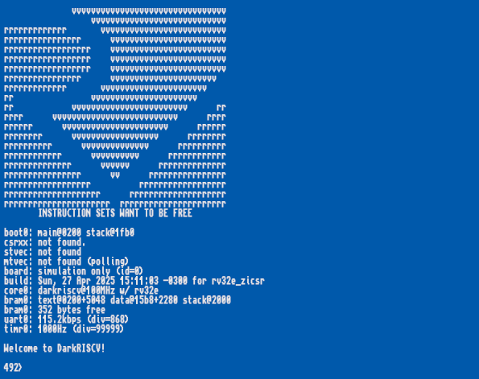
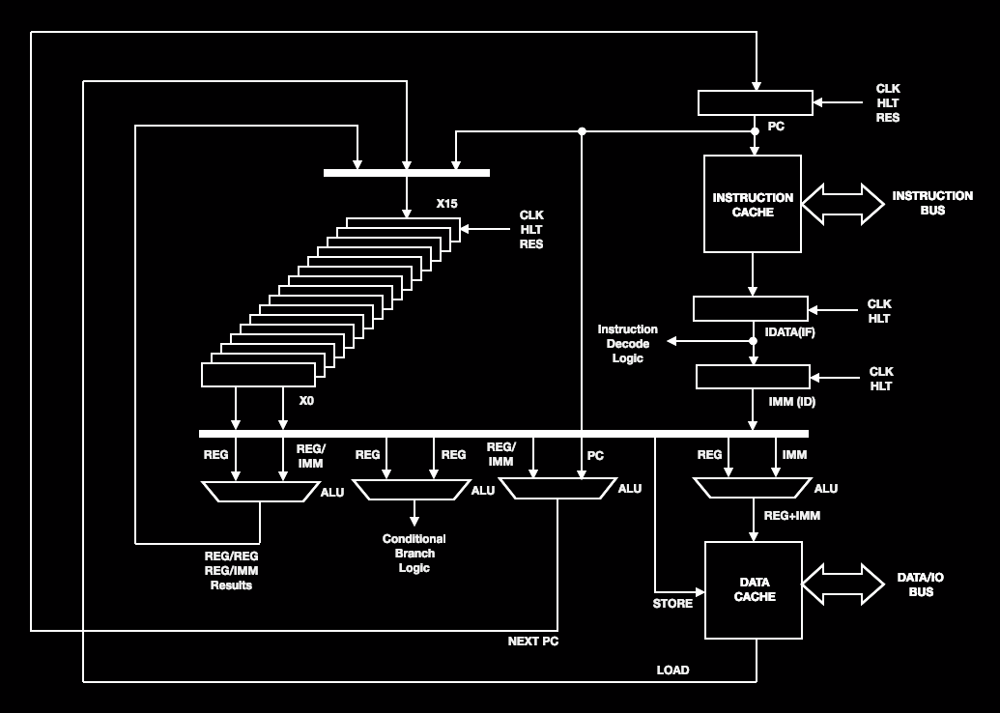
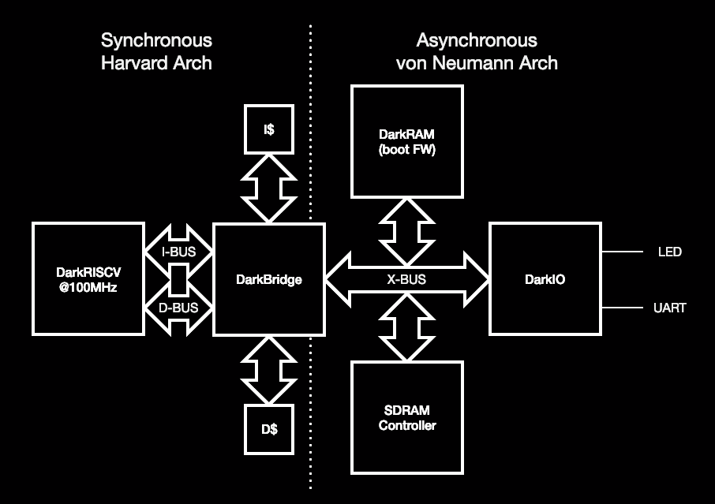

# DarkRISCV — Project Documentation

> **Target audience:** undergraduate students and hobbyists who are encountering
> processor design for the first time. No prior hardware design experience is
> assumed. Technical terms are introduced gradually and defined in the
> [Glossary](#glossary) at the bottom of this page.

---

## 1. What Is This Project?

**DarkRISCV** is a fully functional, open-source RISC-V processor implemented
entirely in **Verilog** (a hardware description language). Rather than being a
physical chip, it is a **soft-core CPU**: a textual description of a processor
that is loaded onto a programmable chip called an **FPGA**, which then behaves
exactly as that processor at hardware speeds.

The project implements the **RISC-V RV32I** base instruction set — a free and
open specification for 32-bit integer processors created at UC Berkeley.
Because the specification is openly published, anyone can implement it; this
repository is one such implementation.

The complete system — processor, memory, serial port, timer, LEDs — is
integrated into a **System-on-Chip (SoC)** called *DarkSoCV*. The SoC is
targeted at the **Terasic DE2** development board (Altera Cyclone II FPGA) and
can be simulated on any PC using **Icarus Verilog** (a free, open-source tool).

### Key Specifications

| Property | Value |
|---|---|
| Instruction set | RISC-V **RV32I** (32-bit integer base) |
| Optional ISA extensions | RV32E (reduced registers), M-ext (hardware multiply), Zicsr (CSRs) |
| Pipeline | **3-stage**: Fetch → Decode → Execute |
| Target clock frequency | **100 MHz** (on DE2 Cyclone II FPGA) |
| On-chip memory | Up to **32 KB** Block RAM (configurable via `MLEN`) |
| Peripherals | UART (serial), Timer, LEDs, GPIO, SPI (optional) |
| Hardware description language | **Verilog HDL** |
| Simulator | **Icarus Verilog** (`iverilog`) |
| FPGA toolchain | **Quartus Prime** (Altera/Intel) |
| License | BSD |

---

## 2. How to Navigate This Documentation

The `doc/` folder contains all the narrative documentation. Each file
addresses one layer of the system, from the ground up:

| Document | What you will learn |
|---|---|
| **You are here** — `README.md` | Project overview, diagram guide, glossary, reading order |
| [doc/cpu-core.md](doc/cpu-core.md) | How the CPU fetches, decodes, and executes RISC-V instructions; the pipeline; the ALU; branches; the register file; interrupts |
| [doc/soc-architecture.md](doc/soc-architecture.md) | How all modules (CPU, memory, UART, timer, LEDs) are wired together into a complete computer; bus architecture; address decoding |
| [doc/memory-and-io.md](doc/memory-and-io.md) | How firmware (C code) reads and writes memory and peripheral registers; memory map; UART protocol; timer; LEDs |
| [doc/simulation-guide.md](doc/simulation-guide.md) | Step-by-step: build firmware → compile RTL → run simulation → interpret output → view waveforms |
| [doc/diagrams.md](doc/diagrams.md) | **In-depth visual guide** to all three architecture diagrams (PNG files); every block and signal explained |
| [doc/rtl-implementation.md](doc/rtl-implementation.md) | **RTL source walkthrough** — how to read the Verilog files in `rtl/`; what each module does; how the code maps to the hardware concepts |

---

## 3. The Three Architecture Diagrams

Three PNG images in this folder are the primary visual reference for the
design. A brief description of each follows; full analysis is in
[doc/diagrams.md](doc/diagrams.md).

### 3.1 `boot.png` — Simulation Output Screenshot



**What it shows:** A screenshot of the simulation terminal output — the text
that the CPU's firmware prints over the serial port when it first powers on.
This is the simplest diagram: it is not a hardware diagram at all, but rather
evidence that the processor is running correctly.

**Key lines to notice:**
- `boot0: main@0200 stack@01fb0` — the boot assembler placed `main()` at
  memory address `0x0200` and the stack at `0x01fb0`.
- `board: simulation only (id=0)` — the `BOARD_ID` is 0, meaning this is
  running inside the Icarus Verilog simulator rather than real hardware.
- `core0: darkriscv@100MHz w/ rv32e` — the CPU core is configured as RV32E
  (16 registers) and is clocked at 100 MHz.
- `bram0: 352 bytes free` — a memory usage report: only 352 bytes of on-chip
  BRAM are unused.
- `uart0: 115.2kbps (div=868)` — the UART baud rate and the clock divider
  value (100,000,000 ÷ 115,200 ≈ 868).
- `Welcome to DarkRISCV!` followed by `492>` — the shell prompt; `492` is how
  many instructions executed during boot.

Full line-by-line analysis is in [doc/diagrams.md § boot.png](doc/diagrams.md#1-bootpng--the-simulation-boot-screenshot).

---

### 3.2 `darkriscv.png` — CPU Core Block Diagram



**What it shows:** The internal architecture of the `darkriscv.v` CPU core
module — the processor itself, without any surrounding memory or peripherals.

**Reading the diagram top-to-bottom, right-to-left:**

1. **Top-right: PC (Program Counter)** — receives `CLK`, `HLT`, and `RES`
   signals. Holds the address of the next instruction to fetch.

2. **Right column: Instruction path** — `PC` → `INSTRUCTION CACHE` →
   `INSTRUCTION BUS` (connects to memory outside the CPU). The fetched 32-bit
   instruction word flows down through the `IDATA (IF)` pipeline register,
   through the `Instruction Decode Logic`, and into the `IMM (ID)` register
   which holds the decoded immediate value.

3. **Left column: Register file (X0–X15)** — the stacked rectangles
   represent 16 (or 32) general-purpose 32-bit registers. Each register drives
   a wire into the four ALUs below. Register writes (the top feedback arrow)
   are clocked; reads are combinational (simultaneous).

4. **Bottom: Four ALUs working in parallel** — this is the key design
   insight. During the Execute stage, four separate arithmetic units compute
   four things simultaneously:
   - **ALU 1** (leftmost): REG/REG and REG/IMM arithmetic (ADD, SUB, AND, etc.)
   - **ALU 2** (second): Conditional branch logic (BEQ, BNE, BLT…)
   - **ALU 3** (third): NEXT PC calculation (PC+4, PC+offset, or rs1+offset)
   - **ALU 4** (rightmost): Memory address = REG + IMM → feeds the DATA CACHE

5. **Bottom-right: DATA CACHE / DATA/IO BUS** — sends/receives data to/from
   external BRAM, I/O registers, or SDRAM. `STORE` (writes) and `LOAD` (reads
   back into the register file) arrows show the two directions.

6. **NEXT PC loop** — the computed next address feeds all the way back to the
   PC register at the top-right, completing one iteration of the
   fetch-decode-execute cycle.

Full analysis with signal-level detail is in
[doc/diagrams.md § darkriscv.png](doc/diagrams.md#2-darkriscvpng--cpu-core-block-diagram).

---

### 3.3 `darksocv.png` — SoC Architecture Block Diagram



**What it shows:** The complete System-on-Chip (`darksocv.v`), showing how the
CPU connects to the rest of the system. The diagram is split into two halves by
a vertical dotted line, reflecting two different architectural philosophies.

**Left half — Synchronous Harvard Architecture:**
The CPU and its caches form a high-speed island:
- **DarkRISCV @100MHz** — the CPU core, sending two buses outward:
  - **I-BUS** (instruction bus): read-only, fetches one instruction per clock
  - **D-BUS** (data bus): read/write, for load/store memory operations
- **I$** (Instruction Cache) — intercepts instruction fetches; returns
  recently-seen instructions without going to slow main memory
- **D$** (Data Cache) — similar, for data load/store
- **DarkBridge** — the central hub that connects the CPU's two Harvard buses
  to a single shared bus (X-BUS) on the other side

**Right half — Asynchronous Von Neumann Architecture:**
Everything the CPU talks to over the shared X-BUS:
- **DarkRAM (boot FW)** — Block RAM holding the compiled firmware
- **DarkIO** — I/O controller; manages LED outputs and the UART serial port
- **SDRAM Controller** — optional interface to off-chip external DRAM

**Why the split?** The CPU needs simultaneous instruction and data access every
cycle. The cache layer hides the fact that BRAM is slightly slower. To external
memory, only one transaction arrives at a time.

Full analysis with bus-level details in
[doc/diagrams.md § darksocv.png](doc/diagrams.md#3-darksocvpng--soc-architecture-block-diagram).

---

## 4. Project Directory Structure

```
risc-v-cpu/
│
├── README.md                    ← You are here (project index and overview)
│
├── doc/                         ← All narrative documentation
│   ├── diagrams.md                 In-depth guide to all three PNG diagrams
│   ├── rtl-implementation.md       RTL source walkthrough (Verilog deep-dive)
│   ├── cpu-core.md                 CPU pipeline, ALU, registers, interrupts
│   ├── soc-architecture.md         SoC modules, bus architecture, address map
│   ├── memory-and-io.md            Memory map, UART, timer, LEDs, GPIO
│   ├── simulation-guide.md         How to build and run the simulation
│   ├── boot.png                    Screenshot: simulation terminal output
│   ├── darkriscv.png               Diagram: CPU core block diagram
│   └── darksocv.png                Diagram: SoC architecture block diagram
│
├── rtl/                         ← Verilog source (the hardware description)
│   ├── config.vh                   Master configuration switches (pipeline, ISA, memory…)
│   ├── darkriscv.v                 THE CPU CORE — fetch, decode, execute
│   ├── darksocv.v                  Top-level SoC — wires everything together
│   ├── darkbridge.v                Bus bridge — CPU buses ↔ external bus
│   ├── darkram.v                   On-chip Block RAM (program + data)
│   ├── darkio.v                    I/O controller (UART, LEDs, timer, GPIO)
│   ├── darkuart.v                  UART transmitter/receiver
│   ├── darkpll.v                   Clock generator (PLL: 50 MHz → 100 MHz)
│   ├── darkcache.v                 Optional L1 instruction/data cache
│   ├── darkmac.v                   Optional 16×16 multiply-accumulate unit
│   ├── darkspi.v                   Optional SPI master peripheral
│   └── lib/
│       ├── sdram/                  SDRAM controller (external DRAM interface)
│       └── spi/                    SPI master IP core and simulation stubs
│
├── src/                         ← Firmware (C and assembly source)
│   ├── boot.S                      Startup assembly (initialises stack, calls main)
│   ├── darksocv.lds                Linker script (defines memory layout)
│   ├── config.mk                   Compiler paths and flags
│   ├── Makefile                    Build rules (set APPLICATION= to switch apps)
│   ├── darkshell/                  Interactive shell firmware (default)
│   ├── calc/                       Calculator demo (sum, fibonacci, factorial, primes)
│   ├── coremark/                   EEMBC CoreMark performance benchmark
│   └── darklibc/                   Minimal C library (printf, memcpy, I/O…)
│
├── sim/                         ← Simulation infrastructure
│   ├── darksimv.v                  Testbench: clock generator, reset, VCD output
│   ├── run_sim.py                  Simulation runner script
│   ├── trace.py                    Instruction trace analysis tool
│   └── Makefile                    Simulation build and run rules
│
├── boards/                      ← FPGA board support
│   └── de2_cyclone2/               Terasic DE2 (Altera Cyclone II) project files
│       ├── top.v / dut.v           Top-level and SoC instantiation
│       ├── pll.v                   Altera PLL megafunction
│       ├── _darkram.v              Altera altsyncram BRAM
│       ├── darksocv.qpf/.qsf/.sdc Quartus project, pin assignments, timing
│       └── mem2mif.py              Converts firmware hex to Altera MIF format
│
├── scripts/
│   └── helpers.py                  Cross-platform utilities (bin2hex, MLEN extractor)
│
└── Makefile                     ← Root: `make` builds firmware + runs simulation
```

---

## 5. Conceptual Foundation: How a Processor Works

For readers completely new to computer architecture, this section provides the
minimum conceptual background before diving into the detailed documents.

### 5.1 The Fetch-Decode-Execute Loop

Every processor, from the simplest microcontroller to the most complex
supercomputer, executes a continuous loop:

```
1. FETCH   → Read the next instruction from memory
2. DECODE  → Understand what the instruction means
3. EXECUTE → Carry out the operation
4. GOTO 1
```

In DarkRISCV, this loop runs at 100 MHz — 100 million times per second.

### 5.2 Pipelining: The Assembly Line Analogy

A naive processor would finish step 3 before starting step 1 again, wasting
time. A **pipelined** processor works like an assembly line: while instruction N
is being executed, instruction N+1 is being decoded, and instruction N+2 is
being fetched — all at the same time, in different stages.

DarkRISCV uses a **3-stage pipeline**:

```
Clock:   1    2    3    4    5    6
Stage 1 (Fetch):  I1   I2   I3   I4   I5   I6
Stage 2 (Decode):      I1   I2   I3   I4   I5
Stage 3 (Execute):          I1   I2   I3   I4
```

The pipeline means that in steady state, one instruction completes every clock
cycle — approaching the ideal of 1 instruction per cycle (IPC = 1.0).

### 5.3 Why IPC is Less Than 1.0 in Practice

Two situations break the pipeline flow:

**Branch penalty:** When the CPU takes a conditional jump (`if`, `for`, loop
back), the instructions already loaded into earlier pipeline stages belong to
the wrong path. They must be discarded (**pipeline flush**), costing 2 cycles.
DarkRISCV measures approximately CPI = 1.7 (0.6 IPC) for typical code.

**Load latency:** Reading from memory takes 1 extra clock (the memory is
clocked, not instantaneous). The pipeline must pause (**stall**) for 1 cycle
after a load instruction.

### 5.4 Harvard vs Von Neumann Architecture

| Aspect | Harvard | Von Neumann |
|---|---|---|
| Instruction memory | Separate, dedicated | Shared with data |
| Data memory | Separate, dedicated | Shared with instructions |
| Buses | Two independent buses | One shared bus |
| Throughput | Higher (parallel access) | Lower (serialised) |
| Complexity | Higher | Lower |

DarkRISCV is fundamentally a **Harvard** core: it has a dedicated instruction
bus (I-BUS) and a dedicated data bus (D-BUS). However, the SoC supports a
bridge (`darkbridge.v`) that can time-multiplex both buses onto a single shared
bus when needed (for external SDRAM).

---

## 6. Glossary

| Term | Definition |
|---|---|
| **ALU** | Arithmetic Logic Unit — the combinational circuit that performs ADD, SUB, AND, OR, XOR, shifts, and comparisons |
| **ABI** | Application Binary Interface — the convention for how functions pass arguments and return values (register naming: `a0`–`a7`, `ra`, `sp`…) |
| **BRAM** | Block RAM — fast, dedicated memory cells built into the FPGA fabric; used for both program storage and data storage |
| **CPI** | Clocks Per Instruction — average number of clock cycles consumed per instruction; lower is better (ideal = 1.0) |
| **CSR** | Control and Status Register — special-purpose registers (e.g., `mtvec`, `mepc`, `mstatus`) used for interrupt and system control |
| **D-bus** | Data bus — the CPU's read/write port for load and store instructions |
| **FPGA** | Field-Programmable Gate Array — a chip whose internal logic can be reprogrammed by loading a configuration bitstream |
| **Harvard** | Memory architecture with physically separate instruction and data memories, accessed in parallel |
| **HDL** | Hardware Description Language — a programming-like language (Verilog, VHDL) that describes digital circuits rather than algorithms |
| **I-bus** | Instruction bus — the CPU's read-only port for fetching instructions from memory |
| **IPC** | Instructions Per Clock — inverse of CPI; measures pipeline efficiency (ideal = 1.0) |
| **IRQ** | Interrupt Request — an external signal that diverts the CPU to an interrupt service routine |
| **ISA** | Instruction Set Architecture — the publicly defined specification of what binary patterns mean what operations (e.g., RISC-V RV32I) |
| **Linker script** | A configuration file (`.lds`) that tells the linker where to place code (`.text`) and data (`.data`, `.bss`) in memory |
| **LUT** | Look-Up Table — the basic logic element in an FPGA; implements any Boolean function of a fixed number of inputs |
| **MIPS** | Millions of Instructions Per Second — a measure of raw CPU throughput |
| **MIF** | Memory Initialization File — Altera/Intel's format for pre-loading BRAM contents at synthesis time |
| **Pipeline flush** | Discarding instructions that entered the pipeline on the wrong path after a taken branch |
| **Pipeline stall** | Pausing the pipeline for one or more cycles while waiting for memory |
| **PLL** | Phase-Locked Loop — a feedback circuit that multiplies or divides a reference clock frequency |
| **Register** | A tiny, extremely fast storage location inside the CPU core (32 bits wide in RV32I; 16 in RV32E) |
| **RISC-V** | An open, royalty-free instruction set architecture specification originally developed at UC Berkeley |
| **RTL** | Register Transfer Level — a style of hardware description that models circuits as data flowing between registers on clock edges |
| **RV32E** | RISC-V 32-bit Embedded — a variant of RV32I with only 16 registers instead of 32, saving FPGA area |
| **RV32I** | RISC-V 32-bit Integer — the base instruction set with 32 registers and 47 instructions |
| **SoC** | System-on-Chip — a single integrated design containing a CPU core, memory, and peripherals |
| **Soft-core** | A processor implemented in programmable logic (HDL/FPGA) rather than a fixed silicon chip |
| **UART** | Universal Asynchronous Receiver/Transmitter — a serial communication interface; transmits bytes one bit at a time |
| **VCD** | Value Change Dump — a standard file format for recording digital signal waveforms over time; viewed with GTKWave |
| **Verilog** | A hardware description language (IEEE 1364) used to model digital circuits for simulation and synthesis |
| **Von Neumann** | Memory architecture where instruction and data share a single bus; simpler but lower throughput than Harvard |
| **X-BUS** | The internal shared bus in DarkSoCV connecting DarkBridge to BRAM, I/O, and SDRAM |

---

## 7. Recommended Reading Order

Follow this sequence for the best conceptual progression:

1. **[doc/diagrams.md](doc/diagrams.md)** — Start by understanding what the visual
   diagrams show. No code knowledge required; pure architecture concepts.

2. **[doc/cpu-core.md](doc/cpu-core.md)** — Dive into the CPU internals: how
   instructions flow through the 3-stage pipeline, how the ALU works, how
   branches and loads affect timing.

3. **[doc/soc-architecture.md](doc/soc-architecture.md)** — Zoom out to the full SoC:
   how the CPU connects to memory and peripherals; the role of DarkBridge,
   DarkRAM, DarkIO, and the UART.

4. **[doc/memory-and-io.md](doc/memory-and-io.md)** — Understand the software/hardware
   interface: the memory map, how C code writes to an LED, how UART
   transmission works at the bit level.

5. **[doc/rtl-implementation.md](doc/rtl-implementation.md)** — Read the actual Verilog
   source files with guided annotations; understand how hardware concepts
   translate into HDL code.

6. **[doc/simulation-guide.md](doc/simulation-guide.md)** — Run the simulation
   yourself, interpret the boot output, and explore signal waveforms in
   GTKWave.
